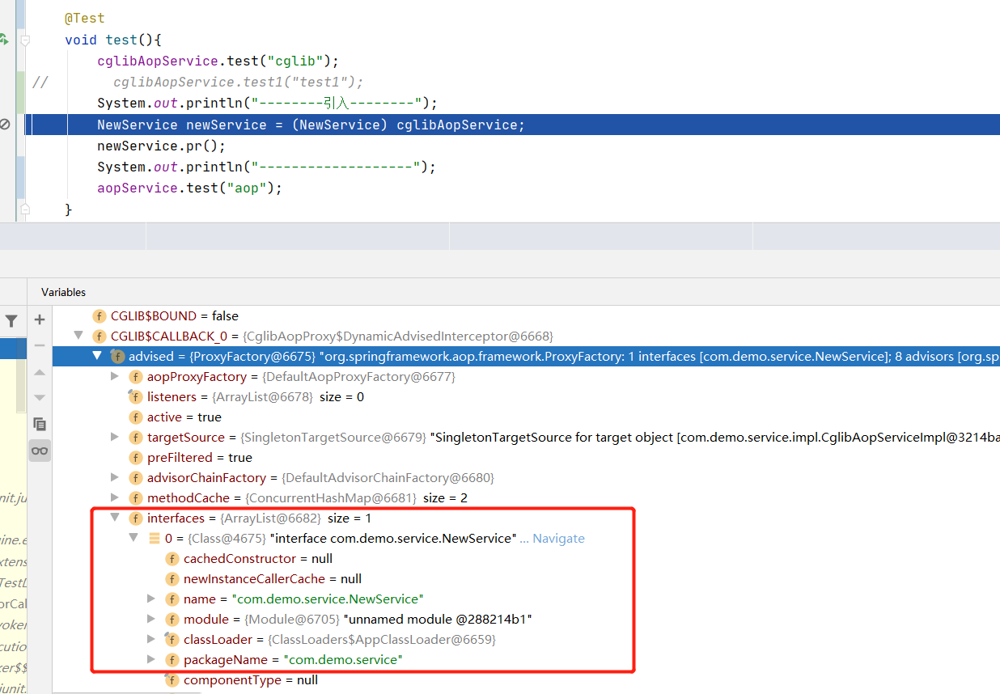

## SpringAOP
### 1.SpringAOP基础概念

#### 1.1 Spring基础名词

- *连接点（Joinpoint）*：在Spring AOP中，一个连接点表示一个方法的执行。
- *切入点（Pointcut）*：通知和一个切入点表达式关联，并在满足这个切入点的连接点上运行（例如，当执行某个特定名称的方法时）。切入点表达式如何和连接点匹配是AOP的核心：Spring缺省使用AspectJ切入点语法。
- *通知（Advice）*：在切面的某个特定的连接点上执行的动作。
- *引入（Introduction）*：用来给一个类型声明额外的方法或属性。Spring允许引入新的接口（以及一个对应的实现）到任何被代理的对象。
- *目标对象（Target Object）*： 被一个或者多个切面所通知的对象。也被称做*被通知（advised）*对象。 既然Spring AOP是通过运行时代理实现的，这个对象永远是一个被代理对象。
- *AOP代理（AOP Proxy）*：AOP框架创建的对象，用来实现切面契约（例如通知方法执行等等）。在Spring中，AOP代理可以是JDK动态代理或者CGLIB代理。
- *织入（Weaving）*：把切面连接到其它的应用程序类型或者对象上，并创建一个被通知的对象。这些可以在编译时（例如使用AspectJ编译器），类加载时和运行时完成。Spring和其他纯Java AOP框架一样，在运行时完成织入。
- *切面（Aspect）*：一个关注点的模块化，这个关注点可能会横切多个对象。

#### 1.2 通知类型

- *前置通知（Before advice）*：在某连接点之前执行的通知，但这个通知不能阻止连接点之前的执行流程（除非它抛出一个异常）。
- *后置通知（After returning advice）*：在某连接点正常完成后执行的通知：例如，一个方法没有抛出任何异常，正常返回。
- *异常通知（After throwing advice）*：在方法抛出异常退出时执行的通知。
- *最终通知（After (finally) advice）*：当某连接点退出的时候执行的通知（不论是正常返回还是异常退出）。
- *环绕通知（Around Advice）*：包围一个连接点的通知，如方法调用。这是最强大的一种通知类型。环绕通知可以在方法调用前后完成自定义的行为。它也会选择是否继续执行连接点或直接返回它自己的返回值或抛出异常来结束执行

### 2.AOP实现

#### 2.1 注解实现

> 代码实现

```java
@Aspect
@Component
public class DemoAspect {
    @Pointcut("execution(* com.demo.aop.service..*.test(..))")
    public void pointCut(){}

    @Pointcut("@annotation(com.demo.aop.annotation.AopAnnotation)")
    public void pointCut1(){}

   @After("pointCut1()")
    public void annotationAfter(){
        System.out.println("annotation,最终通知");
    }

    @Pointcut("@within(com.demo.aop.annotation.AopWithInAnnotation)")
    public void pointCut2(){}
    
    @After("pointCut2()")
    public void annotationBefore(){
        System.out.println("withIn,前置通知");
    }

    @Before("pointCut()")
    public void before(JoinPoint joinPoint){
        Object proxy = joinPoint.getThis();  //代理对象
        Object target = joinPoint.getTarget(); //目标对象
        Object[] args = joinPoint.getArgs();
        String name = joinPoint.getSignature().getName();
        System.out.println("前置通知;参数："+ Arrays.toString(args)+";方法名："+name);
    }
    @After("pointCut()")
    public void after(){
        System.out.println("最终");
    }
    @AfterReturning(value = "pointCut()",returning = "ret")
    public void afterReturning(Object ret){
        System.out.println("后置，返回值：" + ret);
    }
    @Around("pointCut()")
    public void around(ProceedingJoinPoint proceedingJoinPoint){
        try {
            System.out.println("环绕前置");
            proceedingJoinPoint.proceed();//放行
            System.out.println("环绕后置");
        } catch (Throwable e) {
            e.printStackTrace();
        }
    }

    @AfterThrowing(pointcut = "pointCut()",throwing = "e")
    public void afterThrowing(Exception e){
        System.out.println("异常通知："+e);
    }

    //引入
    @DeclareParents(defaultImpl = NewServiceImpl.class,value = "com.demo.aop.service.impl.CglibAopServiceImpl")
    public NewService newService;
}
```

- @Aspect：定义切面

- @PointCut：定义切入点，将符合切入点规则的通知织入到连接点上

  - execution(* com.demo.aop.service..*.test(..))：` * `表示方法修饰符，包名`..`表示当前包和子包，` * `表示类名，方法名，`(..)`表示参数可以为多个
  - @within：自定义注解实现，作用与类上，且没有重载方法@within匹配不到，类似的还有@target，可以阅读这篇文章：https://www.jianshu.com/p/fb109e03edec
  - @annotation：自定义注解实现，作用于方法上

- @Before：前置通知，通过JoinPoint获取基本信息，且其他通知方法同样可以获取

- @After：最终通知

- @AfterReturning：后置通知，获取返回值

- @AfterThrowing：异常通知，获取异常信息

- @Around：环绕通知，参数`ProceedingJoinPoint`

- @DeclareParents：定义引入通知，`defaultImpl`：接口的实现类，`value`：被引入的类，通过给接口提供实现类，允许对象动态的添加实现接口。

  

#### 2.2 xml

```xml

<context:component-scan base-package="com.demo"></context:component-scan>

        <!--aop相关注解的识别@Aspect.@Pointcut,@Before,@After,@AfterReturing,@AfterThrowing，@Around-->
<aop:aspectj-autoproxy></aop:aspectj-autoproxy>
        <!--配置bean-->
<bean id="allAdvice" class="com.demo.aop.DemoAspect"></bean>
<aop:config>
<!--配置bean切面-->
<aop:aspect ref="allAdvice">
    <!--配置表达式-->
    <aop:pointcut id="pointcut" expression="execution(* com.demo.aop.service..*.test(..))"></aop:pointcut>
    <!--配置通知-->
    <aop:before method="before" pointcut-ref="pointcut"></aop:before>
    <aop:after-returning method="afterReturning" pointcut-ref="pointcut" returning="ret"></aop:after-returning>
    <aop:after-throwing method="afterThrowing" pointcut-ref="pointcut" throwing="e"></aop:after-throwing>
    <aop:after method="after" pointcut-ref="pointcut"></aop:after>
    <aop:around method="around" pointcut-ref="pointcut"></aop:around>
</aop:aspect>
</aop:config>
```


### 3. 实现原理
#### 3.1 JDK动态代理

> 代码

```java
public class JDKDynamicProxy implements InvocationHandler {
    private Object target;
    public JDKDynamicProxy(Object target) {
        this.target = target;
    }
    public <T> T getProxy(){
        return (T) Proxy.newProxyInstance(target.getClass().getClassLoader(),target.getClass().getInterfaces(),this);
    }

    @Override
    public Object invoke(Object proxy, Method method, Object[] args) throws Throwable {
        System.out.println("before");
        Object invoke = method.invoke(target, args);
        return invoke;
    }
}
```


问题1：为什么通知的执行顺序是这样的？

因为过滤器链中（ArrayList）中顺序

注意在SpringBoot2.x中 默认使用的是CGlib代理模式，但是`@EnableAspectJAutoProxy(proxyTargetClass = false)`配置默认就为false或者手动修改为false都不生效

只有当去配置文件中配置才行，如下所示，才能使用jdk动态代理，否则即使继承接口也是使用cglib代理

```yaml
spring:
  aop:
    proxy-target-class: false
```


 

