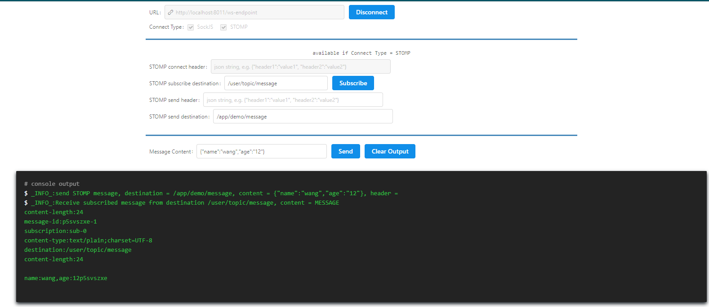

websocket测试网址
```html
http://jxy.me/websocket-debug-tool/
```




在WebSocket配置类`WebSocketConfig`中
```java
public void configureMessageBroker(MessageBrokerRegistry registry) {
    // 启动广播模式代理，只有符合的的路径才发送消息 代理将会处理前缀为“/topic”的消息
    registry.enableSimpleBroker("/topic");
    registry.setApplicationDestinationPrefixes("/app");
    //处理指定用户发送消息 点对点推送默认添加前缀为/user   当配置了enableSimpleBroker时，推送的前缀必须加上配置的路径
    registry.setUserDestinationPrefix("/user");
}
```
当我们配置了enableSimpleBroker的时候，使用WebSocket推送消息的时候必须加上配置的路径
```java
simpMessagingTemplate.convertAndSendToUser(sessionId, "/topic/message", message+sessionId);
```
上面的推送方法`convertAndSendToUser`表示为点对点推送，则在接受方的路径为`/user/topic/message`
且点对点推送需要设置sessionId

当推送方法为`convertAndSend`则为广播，接受方配置路径为`/topic/message`